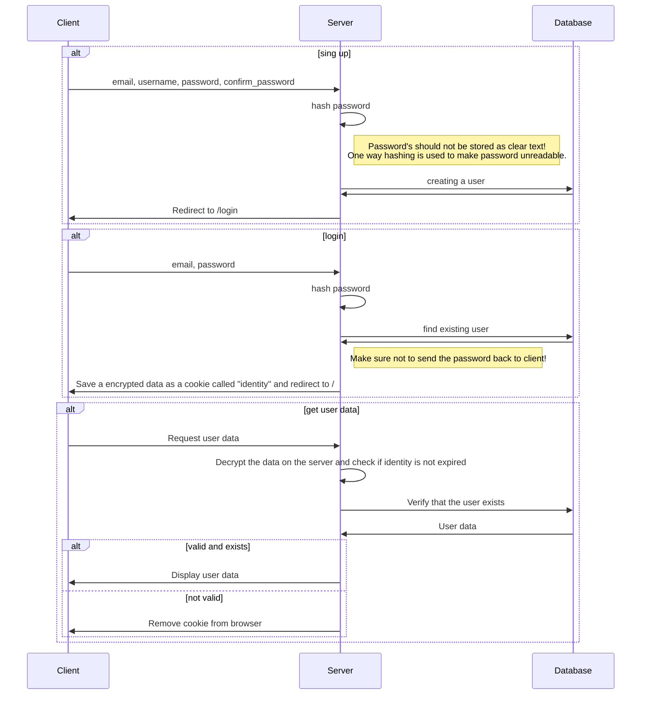

# Summary

This is minimal example demonstrating basic authentication behaviour using client side sessions and server side AES encryption using Next, Prisma and Tailwind.

In this example / tutorial the following behaviour is covered. Some things have been simplified to simplify the example.
For this reason JsonWebTokens (JWTs) have been replaced with normal json's and global (user)states have been not implemented.

